!!! info "类型：笔记"
    前置：*web\start* <br/>
    2020.10.24 创建并添加**项目配置**部分 <br/>
    2020.11.3 创建并添加**Hibernate**部分 <br/>
    2020.11.9 修改**Hibernate**部分 <br/>
    2020.11.19 在**Hibernate**中添加**c3p0**的相关知识。

## struts2项目的创建和配置

!!! tip "配置环境"
    tomcat：apache-tomcat-9.0.38 <br/>
    IDE：IntelliJ IDEA 2020.2.3 <br/>
    Language：java8 / java 11 <br/>
    package manager：gradle-6.5.1-all <br/>
    struts2-core：2.5.25 <br/>
    struts2-dojo-plugin：2.3.37

### 创建新项目

#### 打开IntelliJ IDEA，选择**New Project**

#### 选择**Java Enterprise**，然后选择包管理器为**Gradle**


#### 选择Web Profile


#### 选择路径等内容

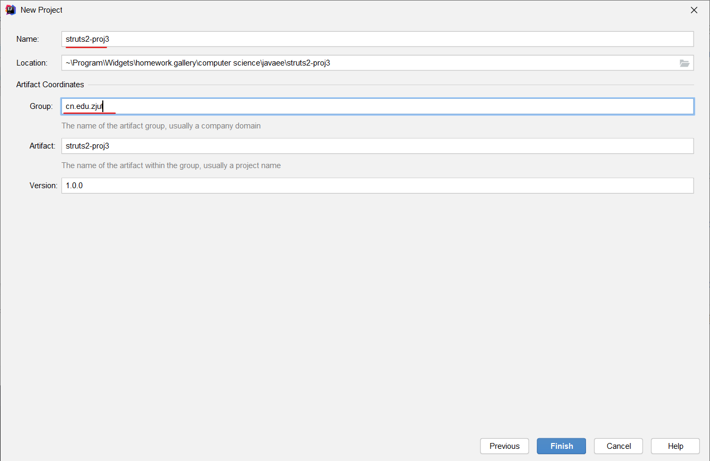

### 修改默认配置

#### 修改gradle的配置


打开`gradle\wrapper\gradle-wrapper.properties`，修改`distributionUrl`为`...gradle-6.5.1-all.zip`，然后重新build程序

#### 删除默认的3项内容


#### 添加struts2插件

选择`File>Settings`，然后选择`Plugins`，在`Marketplace`中搜索**struts 2**，然后安装。

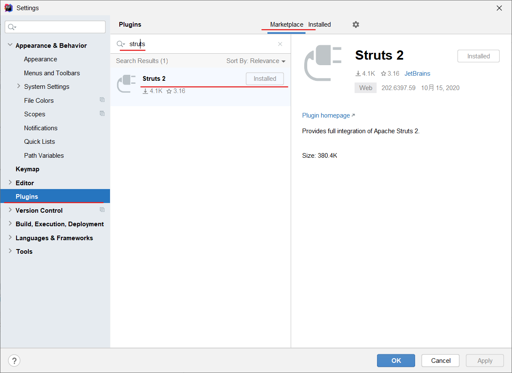

#### 创建主页

在`src\webapp`下创建index.jsp，然后修改内容为`Hello world`


#### 设置启动设置

点击`Add Configuration`，然后点击`+`，再找到`Tomcat Server>Local`

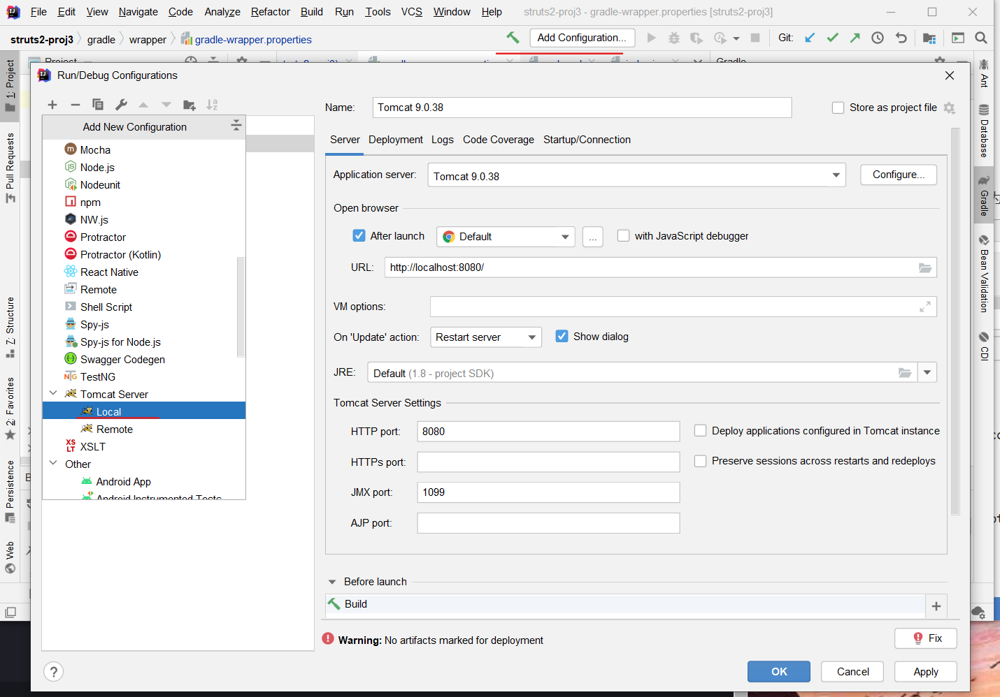

再将菜单栏切换到`Deployment`下，点击右侧的`+`，选择`Artifact..`


选择下方`exploded`的版本

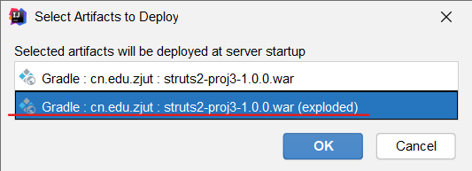

选择`Application Context`为一个合适的路径（例如`/strut2-proj3`）


点击`OK`，完成配置

!!! info "测试"
    现在，点击绿色按钮，你可能会看到下列提示消息，说明此时项目还没有配置好
    ```
    [2020-10-24 10:58:22,928] Artifact Gradle : cn.edu.zjut : struts2-proj3-1.0.0.war (exploded): com.intellij.javaee.oss.admin.jmx.JmxAdminException: com.intellij.execution.ExecutionException: C:\Users\cht\Program\Widgets\homework.gallery\computer science\javaee\struts2-proj3\build\libs\exploded\struts2-proj3-1.0.0.war not found for the web module.
    ```

!!! tip "修改启动默认方式"
    一般来说**Redeploy**的速度要比**Restart Server**的速度要快，可以修改启动项配置的**On 'Update' action**为*Redeploy*

#### 修改gradle的配置

点击`File>Settings`，搜索`Gradle`，找到`Build,Execution,Deployment>Build Tools>Gradle`，，将`Build and run using`和`Run tests using`均修改为**IntelliJ IDEA**


!!! info "再次测试"
    现在，点击绿色按钮，如果配置成功，你将会看到"Hello world!"，表明Java Web部分的配置已经完成。

### 为项目添加struts2的支持

#### 修改`build.gradle`文件，添加两个依赖，并导入两个依赖包

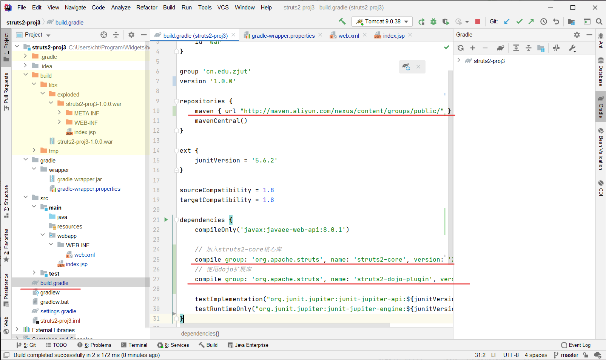

参考配置如下，然后重新build项目

```groovy
plugins {
    id 'java'
    id 'war'
}

group 'cn.edu.zjut'
version '1.0.0'

repositories {
    maven { url 'https://maven.aliyun.com/repository/google' }
    maven { url 'https://maven.aliyun.com/repository/public' }
    mavenCentral()
}

ext {
    junitVersion = '5.6.2'
}

sourceCompatibility = 1.8
targetCompatibility = 1.8

dependencies {
    compileOnly('javax:javaee-web-api:8.0.1')

    // 加入struts2-core核心库
    compile group: 'org.apache.struts', name: 'struts2-core', version: '2.5.25'
    // 使用dojo扩展库
    compile group: 'org.apache.struts', name: 'struts2-dojo-plugin', version: '2.3.37'

    testImplementation("org.junit.jupiter:junit-jupiter-api:${junitVersion}")
    testRuntimeOnly("org.junit.jupiter:junit-jupiter-engine:${junitVersion}")
}

test {
    useJUnitPlatform()
}
```

#### 创建`struts.xml`

在`src\resources`目录下，创建`struts.xml`文件


#### 修改`Project Structure`

点击`File > Project Structure`，进行配置

切换到`WebFacet`，然后删除`JPA`


点击`+`，添加`struts2`

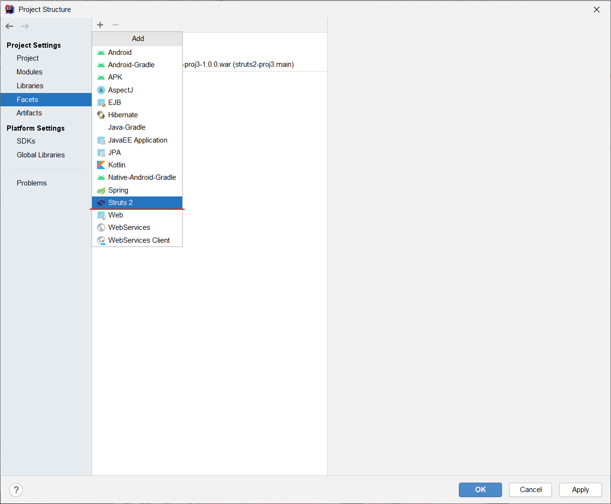

在选择`Parent Facet`时，点击那一项，然后点击`Next`。

选择右边的`+`好，然后勾选上所有的项目，点击OK


返回上级目录后，再次点击OK

#### 修改`web.xml`文件

修改`web.xml`文件，然后添加全局的`struts 2`过滤器

参考代码如下

```xml
<?xml version="1.0" encoding="UTF-8"?>
<web-app xmlns="http://xmlns.jcp.org/xml/ns/javaee"
         xmlns:xsi="http://www.w3.org/2001/XMLSchema-instance"
         xsi:schemaLocation="http://xmlns.jcp.org/xml/ns/javaee http://xmlns.jcp.org/xml/ns/javaee/web-app_4_0.xsd"
         version="4.0">
    <filter>
        <filter-name>struts2</filter-name>
        <filter-class>org.apache.struts2.dispatcher.filter.StrutsPrepareAndExecuteFilter</filter-class>
    </filter>
    <filter-mapping>
        <filter-name>struts2</filter-name>
        <url-pattern>/*</url-pattern>
    </filter-mapping>
</web-app>
```

## 添加第一行代码

### 开始

#### 添加action类

添加包`cn.edu.zjut.action`（可以根据实际情况变化），然后添加`IndexAction`类，添加以下代码

```java
package cn.edu.zjut.action;

import com.opensymphony.xwork2.ActionSupport;

public class IndexAction extends ActionSupport {
    private Integer count;
    
    public IndexAction(){
        count = 0;
    }
    
    public String execute(){
        ++count;
        return SUCCESS;
    }
}
```

#### 修改`struts.xml`文件

配置`package`，`action`等，代码如下

```xml
<?xml version="1.0" encoding="UTF-8"?>

<!DOCTYPE struts PUBLIC
        "-//Apache Software Foundation//DTD Struts Configuration 2.5//EN"
        "http://struts.apache.org/dtds/struts-2.5.dtd">

<struts>
    <package name="strutsBean" extends="struts-default" namespace="/">
        <action name="index" class="cn.edu.zjut.action.IndexAction" method="execute">
            <result name="success">/index.jsp</result>
        </action>
    </package>
</struts>
```

#### 测试效果

在菜单栏中输入`http://localhost:8080/strut2-proj3/index.action`，如果显示"Hello world!"就表示配置成功了。

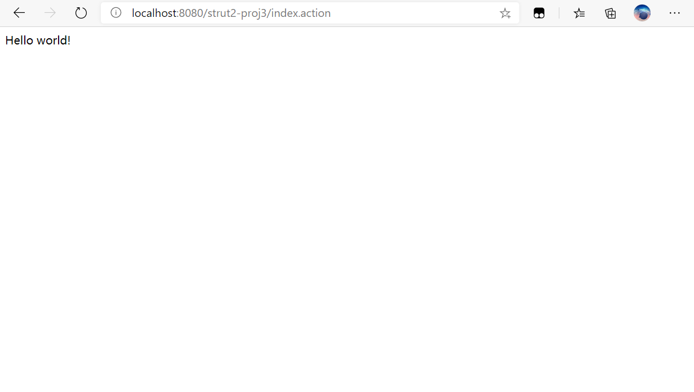

### 国际化

#### 添加国际化(i18n)的支持

在项目文件夹的`src\resources`中，添加`struts.properties`，然后添加下列内容。

```
struts.custom.i18n.resources=local.message
struts.locale=zh-CN
struts.i18n.encoding=GBK
```

然后在`src\resources`中，添加`local`文件夹，然后添加`Resource Bundle`


命名为`message`，然后添加两个Locale，分别为`en_US`和`zh_CN`

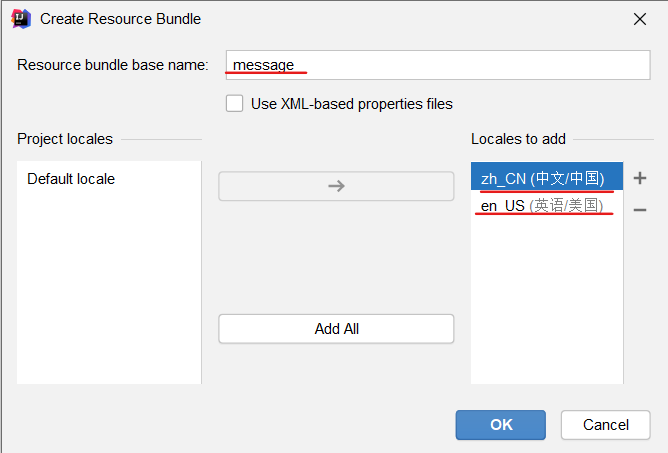

切换到`Resource Bundle`，进行编辑。

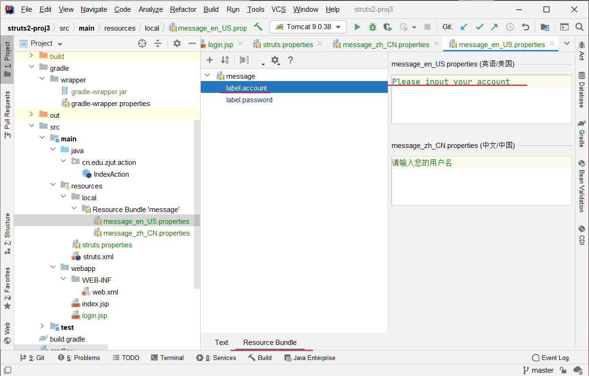

#### 国际化乱码

打开`File>Setting`，找到`Editor>File Encoding`栏

将`Project Encoding`修改为**UTF-8**，再勾选下方的**Transparent native-to-ascii conversion**

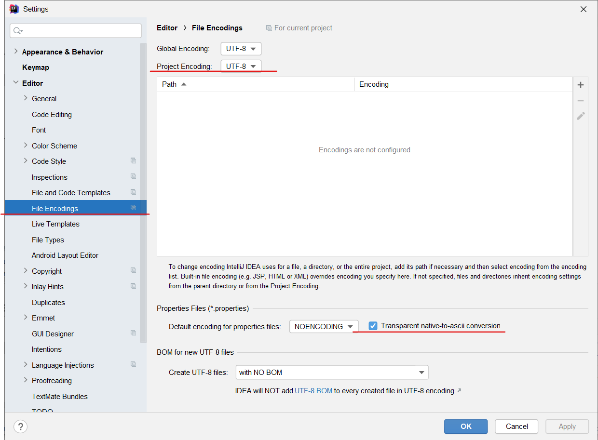

### 拦截器

#### 添加拦截器

在`src\main\java\cn.edu.zjut`下创建package`interceptors`，然后创建`AuthorityInterceptor.java`，代码如下

```java
package cn.edu.zjut.interceptors;

import com.opensymphony.xwork2.*;
import com.opensymphony.xwork2.interceptor.*;

import java.util.Map;

public class AuthorityInterceptor extends AbstractInterceptor {
    @Override
    public String intercept(ActionInvocation invocation) throws Exception {
        System.out.println("Authority Interceptor executed!");
        ActionContext actionContext = invocation.getInvocationContext();
        Map<String, Object> session = actionContext.getSession();
        String user = (String)session.get("user");
        if (user != null){
            return invocation.invoke();
        } else {
            actionContext.put("tip", "您还没有登录，请输入用户名和密码登录系统");
            return Action.LOGIN;
        }
    }
}
```

然后在`struts.xml`中添加对应的配置，参考配置如下

```xml
<?xml version="1.0" encoding="UTF-8"?>

<!DOCTYPE struts PUBLIC
        "-//Apache Software Foundation//DTD Struts Configuration 2.5//EN"
        "http://struts.apache.org/dtds/struts-2.5.dtd">

<struts>
    <package name="strutsBean" extends="struts-default" namespace="/">
        <interceptors>
            <interceptor name="authority" class="cn.edu.zjut.interceptors.AuthorityInterceptor"/>
        </interceptors>
        <action name="index" class="cn.edu.zjut.action.IndexAction" method="execute">
            <result name="success">/index.jsp</result>
        </action>
        <action name="login" class="cn.edu.zjut.action.UserAction" method="login">
            <result name="success">/loginSuccess.jsp</result>
            <result name="fail">/login.jsp</result>
            <result name="input">/login.jsp</result>
        </action>
        <action name="register" class="cn.edu.zjut.action.UserAction" method="register">
            <result name="success">/registerSuccess.jsp</result>
            <result name="fail">/register.jsp</result>
            <result name="input">/register.jsp</result>
        </action>
        <action name="allItems" class="cn.edu.zjut.action.ItemAction" method="getAllItems">
            <result name="success">/itemList.jsp</result>
            <!-- 配置系统默认拦截器 -->
            <interceptor-ref name="defaultStack"/>
            <!-- 配置authority拦截器 -->
            <interceptor-ref name="authority"/>
        </action>
    </package>
</struts>
```

#### 拦截器的配置

[教程](https://www.cnblogs.com/libin6505/p/10429283.html)

## 提高

### 添加Hibernate框架的支持

!!! tip "配置环境"
    tomcat：apache-tomcat-9.0.38 <br/>
    IDE：IntelliJ IDEA 2020.2.3 <br/>
    Language：java8 / java 11 <br/>
    package manager：gradle-6.5.1-all <br/>
    struts2-core：2.5.25 <br/>
    struts2-dojo-plugin：2.3.37 <br/>
    mysql: <br/>

#### 安装数据库

这里安装的是Mysql数据库，具体操作逻辑见安装Mysql教程

#### 使用IDE连接数据库

点击最右侧的`Database`，然后选择`Data Source`>`Mysql`，然后安装`Mysql JDBC驱动`


!!! warning "网络问题"
    在安装此Mysql JDBC驱动很容易出现网络异常的问题，因此JDBC驱动很可能下载不到，具体方法暂时还没有。需要之后的补充

然后设置好各个参数，点击`Test Connection`，观察是否连通。


如果连通后，新建一个`database`，命名为`testdb`（或者改为其他）

#### 新建数据库

!!! info "注意事项"
    创建数据库时，请一定按照下列方式手动创建，否则会造成无法存储中文的问题。

```sql
create database if not exists chtHibernateDb character set utf8mb4 collate utf8mb4_bin;
```

#### 添加必要的依赖

修改项目目录下的`build.gradle`文件，然后添加以下两个依赖。修改后的`build.gradle`文件参考如下，然后build。

```groovy hl_lines="28-33" 
plugins {
    id 'java'
    id 'war'
}

group 'cn.edu.zjut'
version '1.0'

repositories {
    maven { url 'https://maven.aliyun.com/repository/google' }
    maven { url 'https://maven.aliyun.com/repository/public' }
    mavenCentral()
}

ext {
    junitVersion = '5.6.2'
}

sourceCompatibility = 1.8
targetCompatibility = 1.8

dependencies {
    compileOnly('javax:javaee-web-api:8.0.1')

    // 加入struts2-core核心库
    compile group: 'org.apache.struts', name: 'struts2-core', version: '2.5.25'
    // 使用dojo扩展库
    compile group: 'org.apache.struts', name: 'struts2-dojo-plugin', version: '2.3.37'
    // commons-logging
    compile 'commons-logging:commons-logging:1.1.1'
    // hibernate
    compile 'org.hibernate:hibernate-core:5.4.22.Final'
    // mysql
    compile 'mysql:mysql-connector-java:8.0.22'


    testImplementation("org.junit.jupiter:junit-jupiter-api:${junitVersion}")
    testRuntimeOnly("org.junit.jupiter:junit-jupiter-engine:${junitVersion}")
}

test {
    useJUnitPlatform()
}
```

#### 新建数据表

##### 新建一个Mysql的数据表

```sql
create table customer
(
   customerId int not null comment '用户编号',
   account varchar(20) null comment '登录用户名',
   password varchar(20) null comment '登录密码',
   name varchar(20) null comment '真实姓名',
   sex tinyint(1) null comment '性别',
   birthday date null comment '出生日期',
   phone varchar(20) null comment '联系电话',
   email varchar(100) null comment '电子邮箱',
   address varchar(200) null comment '联系地址',
   zipcode varchar(10) null comment '邮政编码',
   fax varchar(20) null comment '传真号码',
   constraint customer_pk
      primary key (customerId)
);
```

##### 插入三条记录

```sql
insert into customer values(1,'zjut','Zjut',null,null,null,null,null,null,null);
insert into customer values(2,'admin','Admin',null,null,null,null,null,null,null);
insert into customer values(3,'temp','Temp',null,null,null,null,null,null,null);
```

#### 创建po类和对应的配置

##### po

创建包名`cn.edu.zjut.po`，然后创建`Customer.java`，代码如下

!!! warning "注意事项"
    在创建po类时，应当使用可为null的对象，而不是基本类型。

```java hl_lines="29"
package cn.edu.zjut.po;

import java.io.Serializable;
import java.util.Date;


public class Customer implements Serializable {
    public Customer() {
    }

    public Customer(int customerId, String account, String password, String name, Boolean sex, Date birthday, String phone, String email, String address, String zipcode, String fax) {
        this.customerId = customerId;
        this.account = account;
        this.password = password;
        this.name = name;
        this.sex = sex;
        this.birthday = birthday;
        this.phone = phone;
        this.email = email;
        this.address = address;
        this.zipcode = zipcode;
        this.fax = fax;
    }

    private int customerId;
    private String account;
    private String password;
    private String name;
    private Boolean sex;
    private Date birthday;
    private String phone;
    private String email;
    private String address;
    private String zipcode;
    private String fax;

    // 省略getters/setters
}
```

##### hibernate mapping

创建目录`src\resources\cn.edu.zjut.po`（和`java`中的包路径一致），然后在该目录下创建`Customer.hbm.xml`文件，然后添加下列内容

!!! warning "文件创建"
    创建`cn\edu\zjut\po`应当一个个文件夹创建，而不应该一次创建，因为IDE中空的文件夹会自动以.连接并合并。

!!! info "注意事项"
    在`hibernate-mapping>class`中，应当使用schema而不是catogory来指定数据库的名称。

```xml hl_lines="6"
<?xml version="1.0" encoding="UTF-8" ?>
<!DOCTYPE hibernate-mapping PUBLIC
    "-//Hibernate/Hibernate Mapping DTD3.0//EN"
    "http://hibernate.sourceforge.net/hibernate-mapping-3.0.dtd">
<hibernate-mapping>
    <class name="cn.edu.zjut.po.Customer" table="customer" schema="chtHibernateDb">
        <id name="customerId" type="int">
            <column name="customerId"/>
            <generator class="assigned"/>
        </id>
        <property name="account" type="string">
            <column name="account" length="20" unique="true"/>
        </property>
        <property name="password" type="string">
            <column name="password" length="20"/>
        </property>
        <property name="name" type="string">
            <column name="name" length="20"/>
        </property>
        <property name="sex" type="java.lang.Boolean">
            <column name="sex"/>
        </property>
        <property name="birthday" type="date">
            <column name="birthday" length="10"/>
        </property>
        <property name="phone" type="string">
            <column name="phone" length="20"/>
        </property>
        <property name="email" type="string">
            <column name="email" length="100"/>
        </property>
        <property name="address" type="string">
            <column name="address" length="200"/>
        </property>
        <property name="zipcode" type="string">
            <column name="zipcode" length="10"/>
        </property>
        <property name="fax" type="string">
            <column name="fax" length="20"/>
        </property>
    </class>
</hibernate-mapping>
```

##### hibernate config

在`src\resources`下创建`hibernate.cfg.xml`文件，内容填充如下。

!!! info "注意事项"
    请将`$url`,`$user`,`$password`修改为自己的数据库配置。<br/>
    `driver_class`应当使用`com.mysql.cj.jdbc.Driver`，而不是`com.mysql.jdbc.Driver` <br/>
    `$url`请以`?useUnicode=true&characterEncoding=utf8`结尾，来解决中文乱码的问题。在xml文档中，使用`?useUnicode=true&amp;characterEncoding=utf8`或者`<![CDATA[jdbc:mysql://$path?useUnicode=true&characterEncoding=utf8]]>` <br/>
    hibernate.dialect需要根据具体的数据库进行更改，当使用MySQL5.x版本时，需要使用`org.hibernate.dialect.MySQL5Dialect`，使用MySQL8.x版本时，需要使用`org.hibernate.dialect.MySQLDialect`

```xml hl_lines="8 11 14 17"
<?xml version="1.0" encoding="UTF-8" ?>
<!DOCTYPE hibernate-configuration PUBLIC
        "-//Hibernate/Hibernate Configuration DTD 3.0//EN"
        "http://hibernate.sourceforge.net/hibernate-configuration-3.0.dtd">
<hibernate-configuration>
    <session-factory name="HibernateSessionFactory">
        <property name="hibernate.connection.driver_class">
            com.mysql.cj.jdbc.Driver
        </property>
        <property name="hibernate.connection.url">
            ${url}
        </property>
        <property name="hibernate.connection.username">
            ${user}
        </property>
        <property name="hibernate.connection.password">
            ${password}
        </property>
        <property name="hibernate.dialect">
            org.hibernate.dialect.MySQL5Dialect
        </property>
        <mapping resource="cn/edu/zjut/po/Customer.hbm.xml"/>
    </session-factory>
</hibernate-configuration>
```

#### 创建SessionUtil和CustomerDao

##### SessionUtil

!!! info "会话管理"
    在Hibernate中，不推荐使用`openSession()`多次创建对象，而使用`getSession()`来获取session。在这个例子中，我们使用单会话的模式来进行管理。

在`cn.edu.zjut.dao`中创建SessionUtil类，进行session的管理。

!!! bug "代码漏洞"
    下面的代码存在问题，请使用后面的会话管理的例子。

```java
package cn.edu.zjut.dao;

import org.hibernate.Session;
import org.hibernate.SessionFactory;
import org.hibernate.cfg.Configuration;

public class SessionUtil {
    private static Session session;

    public static Session getSession(){
        if (session == null) {
            SessionFactory sessionFactory = new Configuration()
                    .configure().buildSessionFactory();
            session = sessionFactory.openSession();
        }
        return session;
    }
}
```

##### CustomerDao

修改`CustomerDao.java`

```java
package cn.edu.zjut.dao;

import cn.edu.zjut.po.Customer;
import org.apache.commons.logging.Log;
import org.apache.commons.logging.LogFactory;
import org.hibernate.Session;
import org.hibernate.query.Query;

import java.io.Serializable;
import java.util.List;

@SuppressWarnings({"unchecked"})
public class CustomerDao implements Serializable {
    private final Log log = LogFactory.getLog(CustomerDao.class);

    public <T> List<T> findByHql(String hql) throws RuntimeException {
        log.debug("finding LoginUser instance by hql");

        Session session = SessionUtil.getSession();
        Query<T> queryObject = (Query<T>) session.createQuery(hql);
        return queryObject.list();
    }

    public void save(Customer customer) throws RuntimeException {
        log.debug("saving customer instance");

        Session session = SessionUtil.getSession();
        session.save(customer);
    }
}
```

#### 修改UserService

cn.edu.zjut.service

```java
package cn.edu.zjut.service;

import cn.edu.zjut.dao.CustomerDao;
import cn.edu.zjut.dao.SessionUtil;
import cn.edu.zjut.po.Customer;
import org.hibernate.Session;
import org.hibernate.Transaction;

import java.util.List;

public class UserService {
    public boolean login(Customer loginUser) {
        String account = loginUser.getAccount();
        String password = loginUser.getPassword();
        String hql = "from Customer as user where account='"
                +account+ "' and password='" + password +"'";
        CustomerDao dao = new CustomerDao();
        List<Customer> customerList = dao.findByHql(hql);
        return !customerList.isEmpty();
    }

    public void register(Customer loginUser) {
        Session session = SessionUtil.getSession();
        Transaction transaction = session.beginTransaction();
        CustomerDao dao = new CustomerDao();
        dao.save(loginUser);
        transaction.commit();
    }
}
```

### Hibernate扩展

#### 复合主键

我们以表`item`，主键`(ISBN,title)`做为例子讲解实例。

##### 改造Item

首先我们改造类`Item`为`ItemPK`和`Item`两个类。带入如下

cn.edu.zjut.po.ItemPK.java

```java
package cn.edu.zjut.po;

import java.io.Serializable;

public class ItemPK implements Serializable {
    private String ISBN;
    private String title;

    // embering getters/setters
}
```

cn.edu.zjut.po.Item.java

```java
package cn.edu.zjut.po;

import java.sql.Blob;

public class Item {
    private ItemPK itemPK;
    private String description;
    private Float cost;
    private Blob image;

    public Item(){

    }

    public Item(ItemPK itemPK) {
        this.itemPK = itemPK;
    }

    // embering getters/setters
}
```

##### 修改Item.hbm.xml

然后修改Item.hbm.xml，使用`<composite-id>`来标识主键，这样类对象就会和映射文件正确对应。

```xml hl_lines="7-10"
<?xml version="1.0" encoding="UTF-8" ?>
<!DOCTYPE hibernate-mapping PUBLIC
        "-//Hibernate/Hibernate Mapping DTD3.0//EN"
        "http://hibernate.sourceforge.net/hibernate-mapping-3.0.dtd">
<hibernate-mapping>
    <class name="cn.edu.zjut.po.Item" table="item" schema="chtHibernateDb">
        <composite-id name="itemPK" class="cn.edu.zjut.po.ItemPK">
            <key-property name="ISBN" column="ISBN"/>
            <key-property name="title" column="title"/>
        </composite-id>
        <property name="description" type="string">
            <column name="description" length="120"/>
        </property>
        <property name="cost" type="java.lang.Float">
            <column name="cost"/>
        </property>
        <property name="image" type="java.sql.Blob">
            <column name="image"/>
        </property>
    </class>
</hibernate-mapping>
```

##### 修改itemList.jsp的OGNL表达式

此时，由于`Item.java`的结构已经更改，因此应当继续修改`itemList.jsp`，代码如下

```jsp hl_lines="17 18"
<%@ page contentType="text/html;charset=UTF-8" language="java" %>
<html>
<head>
    <title>商品信息</title>
</head>
<body>
    <h1>商品列表</h1>
    <table style="border: 1px solid black">
        <tr>
            <th>编号</th>
            <th>书名</th>
            <th>说明</th>
            <th>单价</th>
        </tr>
        <s:iterator value="items">
            <tr>
                <td><s:property value="itemPK.ISBN"/></td>
                <td><s:property value="itemPK.title"/></td>
                <td><s:property value="description"/></td>
                <td><s:property value="cost"/></td>
            </tr>
        </s:iterator>
    </table>
</body>
</html>
```

#### 基于设计的粒度设计

基于设计的粒度设计适用于单表对应多类，其中多个字段构成一个聚合属性。

我们以表`customer`为例进行举例。

##### 改造Customer

我们改造`Customer`为`Customer`和`ContactInfo`两个类。

cn.edu.zjut.po.Customer.java

```java hl_lines="26"
package cn.edu.zjut.po;

import java.io.Serializable;
import java.util.Date;

public class Customer implements Serializable {
    public Customer() {
    }

    public Customer(int customerId, String account, String password, String name, Boolean sex, Date birthday, ContactInfo contactInfo) {
        this.customerId = customerId;
        this.account = account;
        this.password = password;
        this.name = name;
        this.sex = sex;
        this.birthday = birthday;
        this.contactInfo = contactInfo;
    }

    private int customerId;
    private String account;
    private String password;
    private String name;
    private Boolean sex;
    private Date birthday;
    private ContactInfo contactInfo;

    // embering getters/setters
}
```

cn.edu.zjut.po.ContactInfo.java

```java
package cn.edu.zjut.po;

import java.io.Serializable;

public class ContactInfo implements Serializable {
    private String phone;
    private String email;
    private String address;
    private String zipcode;
    private String fax;

    public ContactInfo() {}

    //embering getters/setters
}
```

##### 修改Customer.hbm.xml

我们使用`component`来声明构件（聚合属性）

```xml hl_lines="26-42"
<?xml version="1.0" encoding="UTF-8" ?>
<!DOCTYPE hibernate-mapping PUBLIC
    "-//Hibernate/Hibernate Mapping DTD3.0//EN"
    "http://hibernate.sourceforge.net/hibernate-mapping-3.0.dtd">
<hibernate-mapping>
    <class name="cn.edu.zjut.po.Customer" table="customer" schema="chtHibernateDb">
        <id name="customerId" type="int">
            <column name="customerId"/>
            <generator class="assigned"/>
        </id>
        <property name="account" type="string">
            <column name="account" length="20" unique="true"/>
        </property>
        <property name="password" type="string">
            <column name="password" length="20"/>
        </property>
        <property name="name" type="string">
            <column name="name" length="20"/>
        </property>
        <property name="sex" type="java.lang.Boolean">
            <column name="sex" length="1"/>
        </property>
        <property name="birthday" type="date">
            <column name="birthday" length="10"/>
        </property>
        <component name="contactInfo" class="cn.edu.zjut.po.ContactInfo">
            <property name="phone" type="string">
                <column name="phone" length="20"/>
            </property>
            <property name="email" type="string">
                <column name="email" length="100"/>
            </property>
            <property name="address" type="string">
                <column name="address" length="200"/>
            </property>
            <property name="zipcode" type="string">
                <column name="zipcode" length="10"/>
            </property>
            <property name="fax" type="string">
                <column name="fax" length="20"/>
            </property>
        </component>
    </class>
</hibernate-mapping>
```

##### 修改register.jsp

由于`Cusotmer`的结构已经更改，因此应当修改`itemList.jsp`的OGNL表达式

```jsp hl_lines="19-23"
<%@ page contentType="text/html;charset=UTF-8" language="java" %>
<%@ taglib uri="/struts-tags" prefix="s" %>
<%@ taglib prefix="sx" uri="/struts-dojo-tags" %>
<html>
<head>
    <title>注册页面</title>

    <s:head theme="xhtml"/>
    <sx:head parseContent="true" extraLocales="UTF-8"/>
</head>
<body>
<s:form action="register" method="post">
    <s:textfield name="loginUser.account" label="请输入用户名"/>
    <s:password name="loginUser.password" label="请输入密码"/>
    <s:password name="loginUser.repassword" label="重复输入密码"/>
    <s:textfield name="loginUser.name" label="真实姓名"/>
    <s:select list="#{0: '男', 1: '女'}" label="性别"/>
    <sx:datetimepicker name="loginUser.birthday" displayFormat="yyyy-MM-dd" label="请输入生日"/>
    <s:textfield name="loginUser.contactInfo.phone" label="联系电话"/>
    <s:textfield name="loginUser.contactInfo.email" label="电子邮箱"/>
    <s:textfield name="loginUser.contactInfo.address" label="联系地址"/>
    <s:textfield name="loginUser.contactInfo.zipcode" label="邮政编码"/>
    <s:textfield name="loginUser.contactInfo.fax" label="传真"/>
    <s:submit value="注册"/>
    <s:reset value="重置"/>
</s:form>
</body>
</html>
```

#### 基于性能的粒度设计

基于性能的粒度设计在于部分读取，从而减少不必要的读取，提高效率

我们此例以表`item`作为例子

##### 改造Item

新建类`ItemBasic`和`ItemDetail`

cn.edu.zjut.dao.ItemBasic.java

```java
package cn.edu.zjut.po;

public class ItemBasic {
    private String ISBN;
    private String title;
    private String description;
    private Float cost;

    public ItemBasic() {
    }

    public ItemBasic(String ISBN) {
        this.ISBN = ISBN;
    }

    public ItemBasic(String ISBN, String title, String description, Float cost) {
        this.ISBN = ISBN;
        this.title = title;
        this.description = description;
        this.cost = cost;
    }

    
    // embering getters/setters
}
```

cn.edu.zjut.po.ItemDetail.java

```java
package cn.edu.zjut.po;

import java.sql.Blob;

public class ItemDetail extends ItemBasic {
    private Blob image;

    public ItemDetail() {
    }

    public ItemDetail(String ISBN) {
        super(ISBN);
    }

    public ItemDetail(String ISBN, String title, String description, Float cost, Blob image) {
        super(ISBN, title, description, cost);
        this.image = image;
    }

    // embering getters/setters
}
```

##### 修改ItemBasic.hbm.xml和ItemDetail.hbm.xml

cn.edu.zjut.po.ItemBasic.hbm.xml

```xml
<?xml version="1.0" encoding="UTF-8" ?>
<!DOCTYPE hibernate-mapping PUBLIC
        "-//Hibernate/Hibernate Mapping DTD3.0//EN"
        "http://hibernate.sourceforge.net/hibernate-mapping-3.0.dtd">
<hibernate-mapping>
    <class name="cn.edu.zjut.po.ItemBasic" table="item" schema="chtHibernateDb">
        <id name="ISBN" type="string">
            <column name="ISBN" length="20"/>
            <generator class="assigned"/>
        </id>
        <property name="title" type="string">
            <column name="title" length="30"/>
        </property>
        <property name="description" type="string">
            <column name="description" length="120"/>
        </property>
        <property name="cost" type="java.lang.Float">
            <column name="cost"/>
        </property>
    </class>
</hibernate-mapping>
```

cn.edu.zjut.po.ItemDetail.hbm.xml

!!! warning "显式继承"
    当类有继承关系时，需要进行显示声明 <br/>
    `<class polymorphism="explicit">`，否则会重复获取对象，例如下面的例子。

    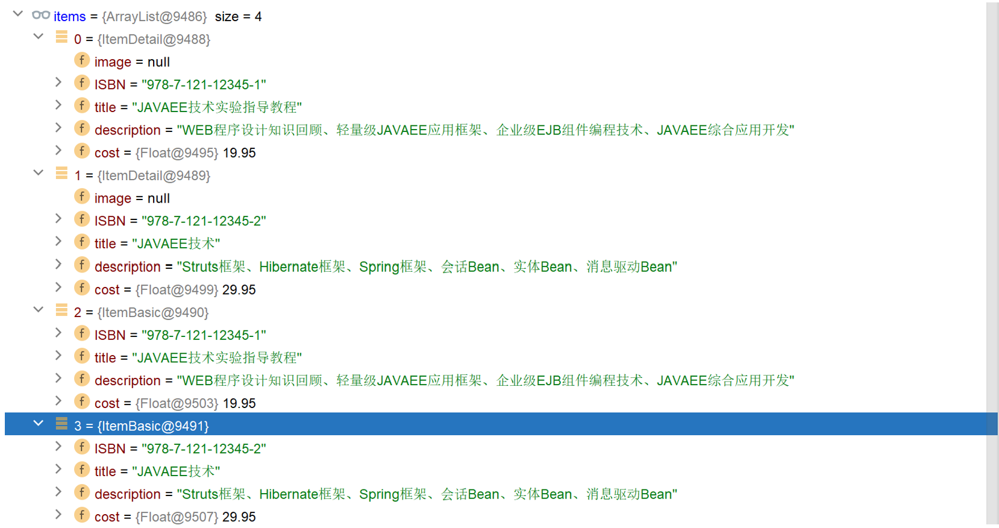

```xml hl_lines="6"
<?xml version="1.0" encoding="UTF-8" ?>
<!DOCTYPE hibernate-mapping PUBLIC
        "-//Hibernate/Hibernate Mapping DTD3.0//EN"
        "http://hibernate.sourceforge.net/hibernate-mapping-3.0.dtd">
<hibernate-mapping>
    <class name="cn.edu.zjut.po.ItemDetail" table="item" schema="chtHibernateDb" polymorphism="explicit">
        <id name="ISBN" type="string">
            <column name="ISBN" length="20"/>
            <generator class="assigned"/>
        </id>
        <property name="title" type="string">
            <column name="title" length="30"/>
        </property>
        <property name="description" type="string">
            <column name="description" length="120"/>
        </property>
        <property name="cost" type="java.lang.Float">
            <column name="cost"/>
        </property>
        <property name="image" type="java.sql.Blob">
            <column name="image"/>
        </property>
    </class>
</hibernate-mapping>

```

#### Hibernate会话管理

!!! info "会话"
    一般来说Hibernate中Session指代一个会话，由于会话对象需要进行数据库的连接，关闭等操作，是一个比较消耗资源的对象，为了提高系统的效率，我们一般使用连接池进行管理，下面仅介绍使用HibernateUtil的自定义实现。

```java
package cn.edu.zjut.dao;

import org.hibernate.HibernateException;
import org.hibernate.Session;
import org.hibernate.SessionFactory;
import org.hibernate.cfg.Configuration;

public class HibernateUtil {
    private static final String CONFIG_FILE_LOCATION="/hibernate.cfg.xml";
    // use thread combination visitor
    private static final ThreadLocal<Session> threadLocal = new ThreadLocal<>();
    private static final Configuration configuration = new Configuration();
    private static SessionFactory sessionFactory;

    private static String configFile = CONFIG_FILE_LOCATION;

    // static initializer is unsafe, please rewrite with injection.
    // because we can't determine when it will be called.
//    static {
//        rebuildSessionFactory();
//    }

    private HibernateUtil() {} // to avoid dynamic constructor

    public static SessionFactory getSessionFactory() {
        return sessionFactory;
    }

    public static void rebuildSessionFactory(){
        try {
            configuration.configure(configFile);
            sessionFactory = configuration.buildSessionFactory();
        } catch (Exception e) {
            // please logging by loggingFactory
            System.err.println("%%%%Error Creating SessionFactory%%%%");
            e.printStackTrace();
        }
    }

    public static String getConfigFile() {
        return configFile;
    }

    public static void setConfigFile(String configFile) {
        HibernateUtil.configFile = configFile;
        sessionFactory = null;
        //rebuildSessionFactory();
    }

    public static Configuration getConfiguration() {
        return configuration;
    }

    public static Session getSession(){
        Session session = threadLocal.get();
        if (session == null || !session.isOpen()) {
            if (sessionFactory == null) {
                rebuildSessionFactory();
            }
            session = sessionFactory.openSession();
            threadLocal.set(session);
        }
        return session;
    }

    public static void closeSession() throws HibernateException {
        Session session = threadLocal.get();
        threadLocal.set(null);
        if (session != null) {
            session.close();
        }
    }
}
```

在上面的代码中，将使用getSession()来复用连接。同时，我们定一个Dao的基类`BaseHibernateDao`，代码如下。

```java
package cn.edu.zjut.dao;

import org.apache.commons.logging.Log;
import org.hibernate.Session;
import org.hibernate.query.Query;

import java.util.List;

@SuppressWarnings({"unchecked"})
public abstract class BaseHibernateDao<TEntity, TKey> {
    public final Session getSession(){
        return HibernateUtil.getSession();
    }

    protected abstract Log getLog();
    protected abstract Class<TEntity> getEntityClass();

    public List<TEntity> findByHql(String hql, Object... args) {
        getLog().debug("finding entity by hql");
        try {
            Query<TEntity> queryObject = (Query<TEntity>)getSession().createQuery(hql);
            for (int i = 0; i < args.length; ++i) {
                queryObject.setParameter(i, args[i]);
            }
            return queryObject.list();
        } catch (RuntimeException e) {
            getLog().debug("find entity by hql failed", e);
            throw e;
        }
    }

    public void save(TEntity entity) {
        getLog().debug("saving entity");
        try {
            getSession().save(entity);
            getLog().debug("save entity successful");
        } catch (RuntimeException e) {
            getLog().error("save failed", e);
            throw e;
        }
    }

    public void update(TEntity entity) {
        getLog().debug("update entity");
        try {
            getSession().update(entity);
            getLog().debug("update entity successful");
        } catch (RuntimeException e) {
            getLog().error("update failed", e);
            throw e;
        }
    }

    public void delete(TEntity entity){
        getLog().debug("delete entity");
        try {
            getSession().delete(entity);
            getLog().debug("delete entity successful");
        } catch (RuntimeException e) {
            getLog().error("delete failed", e);
            throw e;
        }
    }

    public TEntity find(TKey key) {
        getLog().debug("find entity by key");
        TEntity entity;
        try {
            entity = getSession().find(getEntityClass(), key);
            getLog().debug("find entity by key successful");
        } catch (RuntimeException e) {
            getLog().error("find entity by key failed", e);
            throw e;
        }
        return entity;
    }
}
```

#### HQL语句

#### c3p0连接池

我们需要注意，在hibernate 3.3版本之后，core包将不再包含c3p0的支持，详情可看[文章](https://blog.csdn.net/CCZUuniversity/article/details/77823574)

因此，我们需要更新我们的`build.gradle`文件

其中`5.4.24.Final`是目前最新的稳定版，在`Nov, 2020`发布。

```gradle
// hibernate
compile 'org.hibernate:hibernate-core:5.4.24.Final'
// hibernate-c3p0
compile 'org.hibernate:hibernate-c3p0:5.4.24.Final'
```

然后更新`hibernate.cfg.xml`，添加的部分代码如下

```xml
<property name="hibernate.connection.provider_class">org.hibernate.c3p0.internal.C3P0ConnectionProvider</property>
<property name="hibernate.show_sql">true</property>
<property name="hibernate.format_sql">true</property>
<property name="hibernate.use_sql_comments">true</property>
<property name="hibernate.c3p0.max_size">20</property>
<property name="hibernate.c3p0.min_size">1</property>
<property name="hibernate.c3p0.timeout">1800</property>
<property name="hibernate.c3p0.max_statements">50</property>
```

### 添加mybaties框架的支持

#### 导入依赖

在`build.gradle`中添加如下代码

```groovy
plugins {
    id 'java'
}

group 'cn.edu.zjut'
version '1.0.0'

repositories {
    maven { url 'https://maven.aliyun.com/repository/google' }
    maven { url 'https://maven.aliyun.com/repository/public' }
    mavenCentral()
}

ext {
    junitVersion = '5.6.2'
}

sourceCompatibility = 1.8
targetCompatibility = 1.8

dependencies {
    // mybatis
    compile 'org.mybatis:mybatis:3.5.6'
    // mysql
    compile 'mysql:mysql-connector-java:8.0.22'
    // commons-logging
    compile 'commons-logging:commons-logging:1.1.1'
    testImplementation("org.junit.jupiter:junit-jupiter-api:${junitVersion}")
    testRuntimeOnly("org.junit.jupiter:junit-jupiter-engine:${junitVersion}")
}

test {
    useJUnitPlatform()
}
```

#### 创建数据库和数据表

```sql
create table user
(
	uid int not null comment '用户id',
	uname varchar(20) null comment '用户名',
	usex varchar(20) null comment '用户性别',
	constraint user_pk
		primary key (uid)
);

insert into user values (1, 'admin', 'man');
insert into user values (2, 'test', 'woman');
insert into user values (3, 'temp', 'man')
```

#### 创建po类和映射文件

MyUser.java(package:cn.edu.zjut.po)

```java
package cn.edu.zjut.po;

import java.io.Serializable;

public class MyUser implements Serializable {
    private Integer uid;
    private String uname;
    private String usex;

    public Integer getUid() {
        return uid;
    }

    public void setUid(Integer uid) {
        this.uid = uid;
    }

    public String getUname() {
        return uname;
    }

    public void setUname(String uname) {
        this.uname = uname;
    }

    public String getUsex() {
        return usex;
    }

    public void setUsex(String usex) {
        this.usex = usex;
    }
}
```

mybatis-config.xml

```
```

UserMapper.xml(package:cn.edu.zjut.mapper)

!!! info "找不到DTD"
    点开`File>Settings`找到`Schemas and DTDs`，添加一项 <br/>
    uri=http://Mybatis.org/dtd/Mybatis-3-mapper.dtd <br/>
    file=...org/apache/ibatis/builder/xml/mybatis-3-mapper.dtd

```xml
```


## Hibernate框架个人理解

## 附录

### 完整的Sql代码

```sql hl_lines="3"
drop database chtHibernateDb;

create database if not exists chtHibernateDb character set utf8mb4 collate utf8mb4_bin;

use chtHibernateDb;

create table customer
(
    customerId int not null comment '用户编号'
        primary key,
    account varchar(20) null comment '登录用户名',
    password varchar(20) null comment '登录密码',
    name varchar(20) null comment '真实姓名',
    sex tinyint(1) null comment '性别',
    birthday date null comment '出生日期',
    phone varchar(20) null comment '联系电话',
    email varchar(100) null comment '电子邮箱',
    address varchar(200) null comment '联系地址',
    zipcode varchar(10) null comment '邮政编码',
    fax varchar(20) null comment '传真号码'
);

insert into customer values(1,'zjut','Zjut',null,null,null,null,null,null,null,null);
insert into customer values(2,'admin','Admin',null,null,null,null,null,null,null,null);
insert into customer values(3,'temp','Temp',null,null,null,null,null,null,null,null);

create table item
(
	ISBN varchar(20) not null comment 'ISBN号',
	title varchar(30) null comment '书名',
	description varchar(120) null comment '说明',
	cost float null comment '单价',
	image blob null comment '图片',
	constraint item_pk
		primary key (ISBN)
);

insert into item values ('978-7-121-12345-1','JAVAEE技术实验指导教程','WEB程序设计知识回顾、轻量级JAVAEE应用框架、企业级EJB组件编程技术、JAVAEE综合应用开发',19.95,null);
insert into item values ('978-7-121-12345-2','JAVAEE技术', 'Struts框架、Hibernate框架、Spring框架、会话Bean、实体Bean、消息驱动Bean',29.95,null);
```

## 常见bug

### `<sx:datepicker>`未显示

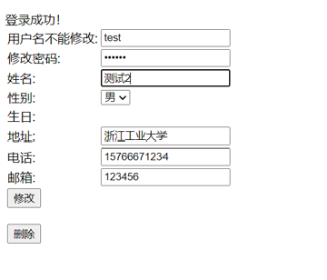

如上图所示，出现日期选择器空白的情况

解决方案：

在`.jsp`的`<head>`中添加以下代码

```xml hl_lines="5"
<head>
    <title>登录成功</title>

    <s:head theme="xhtml"/>
    <sx:head parseContent="true" extraLocales="UTF-8"/>
</head>
```

### 执行session.update()出错

```
org.hibernate.NonUniqueObjectException: A different object with the same identifier value was already associated with the session : [cn.edu.zjut.po.Customer#4]
```

出现的原因：

在执行save()时将会绑定一个transient Object到session()，而struts2框架的变量传递是通过克隆的，因此执行update()时，拿到的customer和session中储存的不一致，而hibernate并不允许update()时出现另外一个键一致的对象。

解决方法：

1. 使用存储在session()中的对象，进行对象之间的数据拷贝。
2. 每次进行更改操作时，关闭session。