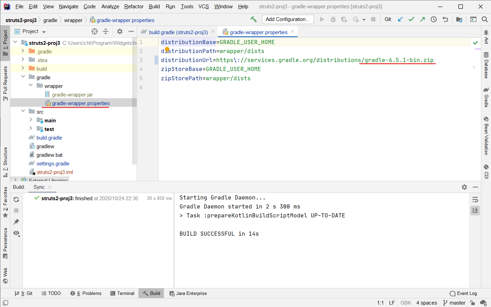
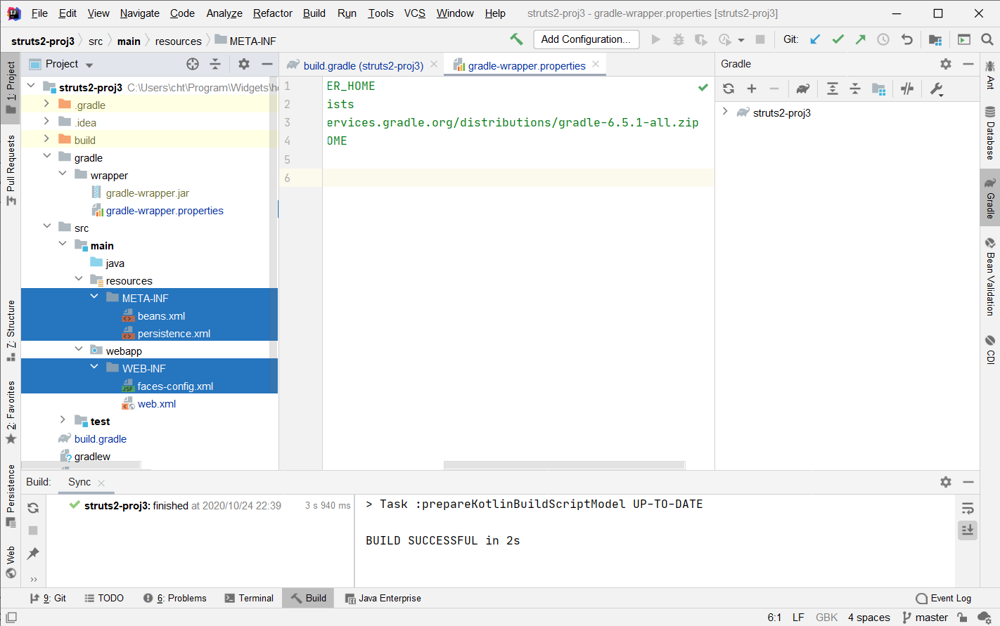
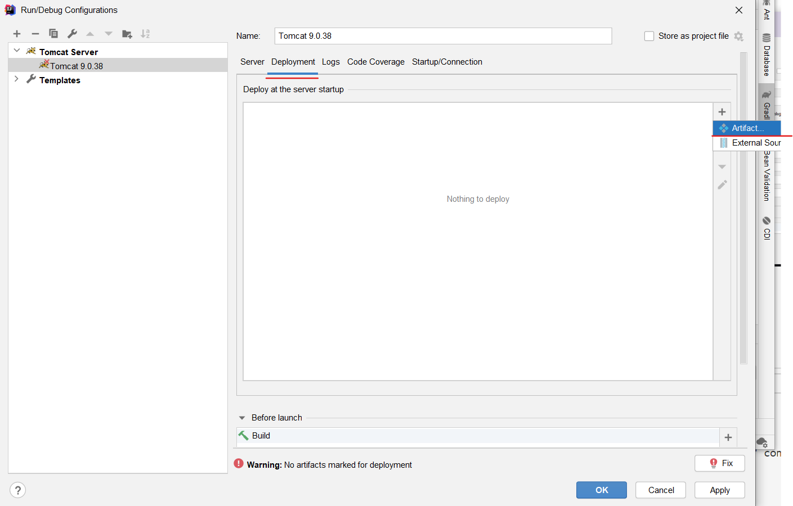
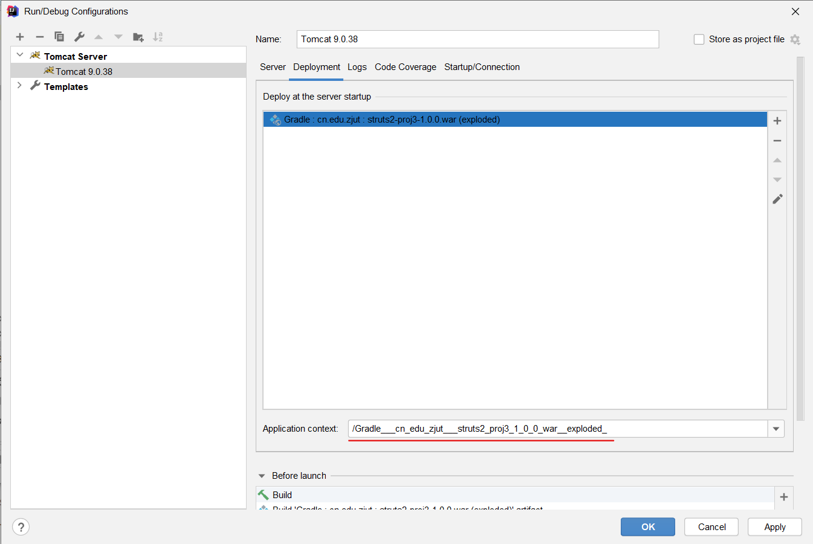
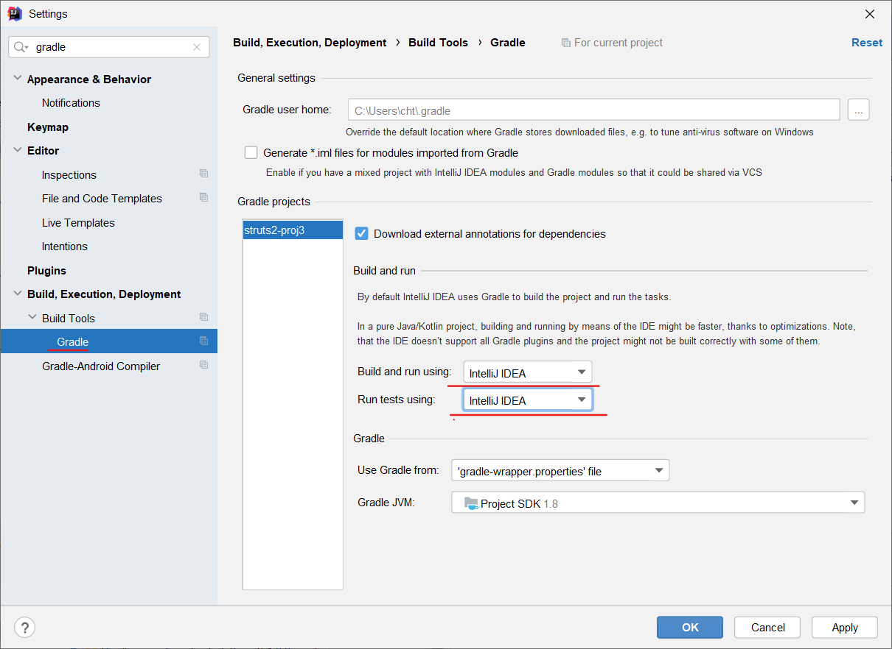
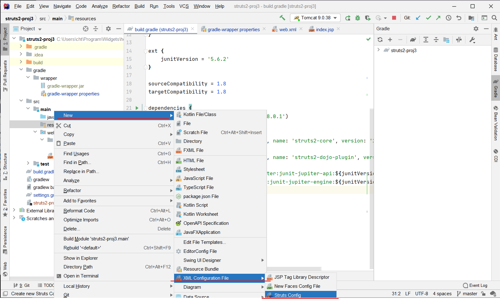
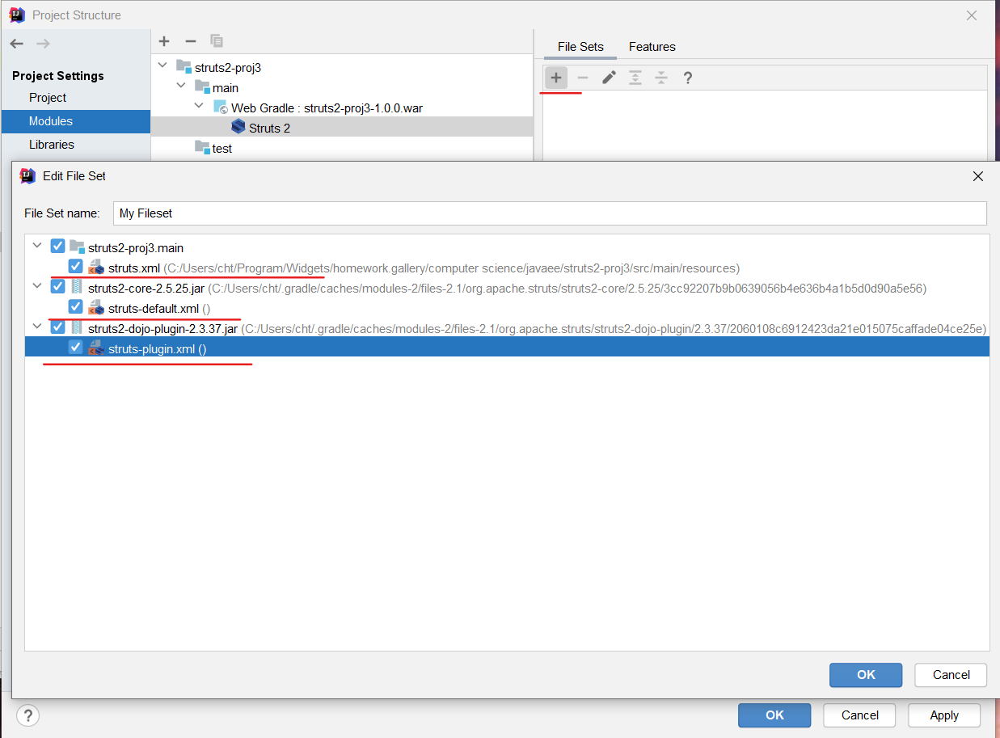

!!! info "类型：笔记"
    前置：*web\start* <br/>
    2020.10.24 创建并添加**项目配置**部分

## struts2项目的创建和配置

!!! tip "配置环境"
    tomcat：apache-tomcat-9.0.38 <br/>
    IDE：IntelliJ IDEA 2020.2.3 <br/>
    Language：java8 / java 11 <br/>
    package manager：gradle-6.5.1-all <br/>
    struts2-core：2.5.25 <br/>
    struts2-dojo-plugin：2.3.37

### 创建新项目

#### 打开IntelliJ IDEA，选择**New Project**

#### 选择**Java Enterprise**，然后选择包管理器为**Gradle**


#### 选择Web Profile


#### 选择路径等内容


### 修改默认配置

#### 修改gradle的配置



打开`gradle\wrapper\gradle-wrapper.properties`，修改`distributionUrl`为`...gradle-6.5.1-all.zip`，然后重新build程序

#### 删除默认的3项内容



#### 添加struts2插件

选择`File>Settings`，然后选择`Plugins`，在`Marketplace`中搜索**struts 2**，然后安装。


#### 创建主页

在`src\webapp`下创建index.jsp，然后修改内容为`Hello world`


#### 设置启动设置

点击`Add Configuration`，然后点击`+`，再找到`Tomcat Server>Local`


再将菜单栏切换到`Deployment`下，点击右侧的`+`，选择`Artifact..`



选择下方`exploded`的版本


选择`Application Context`为一个合适的路径（例如`/strut2-proj3`）



点击`OK`，完成配置

!!! info "测试"
    现在，点击绿色按钮，你可能会看到下列提示消息，说明此时项目还没有配置好
    ```
    [2020-10-24 10:58:22,928] Artifact Gradle : cn.edu.zjut : struts2-proj3-1.0.0.war (exploded): com.intellij.javaee.oss.admin.jmx.JmxAdminException: com.intellij.execution.ExecutionException: C:\Users\cht\Program\Widgets\homework.gallery\computer science\javaee\struts2-proj3\build\libs\exploded\struts2-proj3-1.0.0.war not found for the web module.
    ```

!!! tip "修改启动默认方式"
    一般来说**Redeploy**的速度要比**Restart Server**的速度要快，可以修改启动项配置的**On 'Update' action**为*Redeploy*

#### 修改gradle的配置

点击`File>Settings`，搜索`Gradle`，找到`Build,Execution,Deployment>Build Tools>Gradle`，，将`Build and run using`和`Run tests using`均修改为**IntelliJ IDEA**



!!! info "再次测试"
    现在，点击绿色按钮，如果配置成功，你将会看到"Hello world!"，表明Java Web部分的配置已经完成。

### 为项目添加struts2的支持

#### 修改`build.gradle`文件，添加两个依赖，并导入两个依赖包


参考配置如下，然后重新build项目

```gradle
plugins {
    id 'java'
    id 'war'
}

group 'cn.edu.zjut'
version '1.0.0'

repositories {
    maven { url "http://maven.aliyun.com/nexus/content/groups/public/" }
    mavenCentral()
}

ext {
    junitVersion = '5.6.2'
}

sourceCompatibility = 1.8
targetCompatibility = 1.8

dependencies {
    compileOnly('javax:javaee-web-api:8.0.1')

    // 加入struts2-core核心库
    compile group: 'org.apache.struts', name: 'struts2-core', version: '2.5.25'
    // 使用dojo扩展库
    compile group: 'org.apache.struts', name: 'struts2-dojo-plugin', version: '2.3.37'

    testImplementation("org.junit.jupiter:junit-jupiter-api:${junitVersion}")
    testRuntimeOnly("org.junit.jupiter:junit-jupiter-engine:${junitVersion}")
}

test {
    useJUnitPlatform()
}
```

#### 创建`struts.xml`

在`src\resources`目录下，创建`struts.xml`文件



#### 修改`Project Structure`

点击`File > Project Structure`，进行配置

切换到`WebFacet`，然后删除`JPA`


点击`+`，添加`struts2`


在选择`Parent Facet`时，点击那一项，然后点击`Next`。

选择右边的`+`好，然后勾选上所有的项目，点击OK



返回上级目录后，再次点击OK

#### 修改`web.xml`文件

修改`web.xml`文件，然后添加全局的`struts 2`过滤器

参考代码如下

```xml
<?xml version="1.0" encoding="UTF-8"?>
<web-app xmlns="http://xmlns.jcp.org/xml/ns/javaee"
         xmlns:xsi="http://www.w3.org/2001/XMLSchema-instance"
         xsi:schemaLocation="http://xmlns.jcp.org/xml/ns/javaee http://xmlns.jcp.org/xml/ns/javaee/web-app_4_0.xsd"
         version="4.0">
    <filter>
        <filter-name>struts2</filter-name>
        <filter-class>org.apache.struts2.dispatcher.filter.StrutsPrepareAndExecuteFilter</filter-class>
    </filter>
    <filter-mapping>
        <filter-name>struts2</filter-name>
        <url-pattern>/*</url-pattern>
    </filter-mapping>
</web-app>
```

## 添加第一行代码

### 开始

#### 添加action类

添加包`cn.edu.zjut.action`（可以根据实际情况变化），然后添加`IndexAction`类，添加以下代码

```java
package cn.edu.zjut.action;

import com.opensymphony.xwork2.ActionSupport;

public class IndexAction extends ActionSupport {
    private Integer count;
    
    public IndexAction(){
        count = 0;
    }
    
    public String execute(){
        ++count;
        return SUCCESS;
    }
}
```

#### 修改`struts.xml`文件

配置`package`，`action`等，代码如下

```xml
<?xml version="1.0" encoding="UTF-8"?>

<!DOCTYPE struts PUBLIC
        "-//Apache Software Foundation//DTD Struts Configuration 2.5//EN"
        "http://struts.apache.org/dtds/struts-2.5.dtd">

<struts>
    <package name="strutsBean" extends="struts-default" namespace="/">
        <action name="index" class="cn.edu.zjut.action.IndexAction" method="execute">
            <result name="success">/index.jsp</result>
        </action>
    </package>
</struts>
```

#### 测试效果

在菜单栏中输入`http://localhost:8080/strut2-proj3/index.action`，如果显示"Hello world!"就表示配置成功了。

