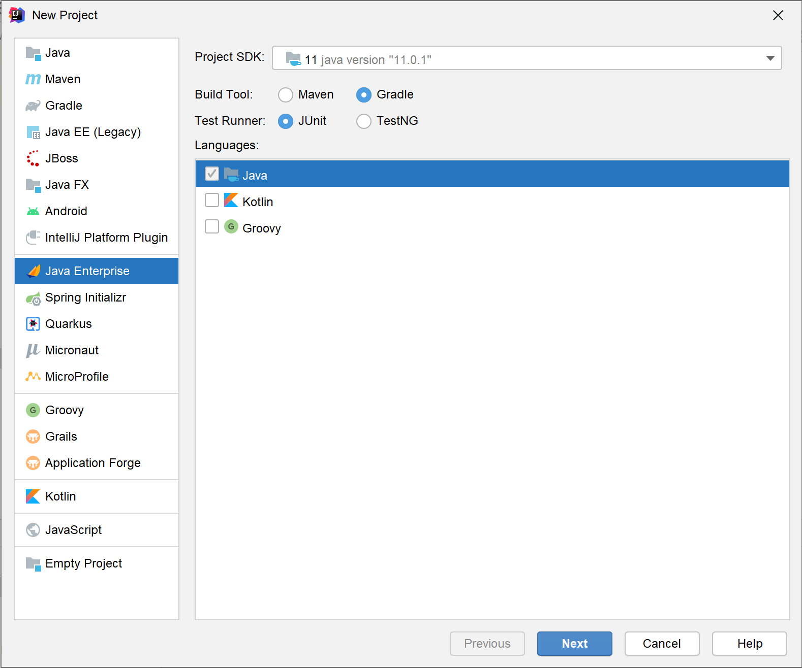

!!! info "类型：笔记"
    2020.11.24 创建编写gradle部分

# 项目管理

## 代码环境管理（包管理）

下面列出常用的代码环境管理工具（一般也成为包管理工具）并给出说明 [^1]

| 管理工具 | 使用语言/项目 | 说明 |
| --- | --- | --- |
| npm | javascript/typescript | 核心文件package.json |
| maven | java/kotlin | 核心文件pom.xml |
| gradle | java/kotlin/android | 核心文件build.gradle或者build.gradle.kts |
| pip | python | 核心文件requirements.txt |
| nuget | .net系 | 核心文件.xxproj |
| pub.dev | dart | 核心文件pubspec.yaml |
| Luarocks | lua | 核心文件.rockspec[^2] |
| canon | cpp | 核心文件CMakeLists.txt |
| 人工管理(lib) | 任何语言 | 使用拷贝类库/包的方式进行管理 |

### gradle

!!! question "选择build.gradle和build.gradle.kts"
    其实两者只有语法的区别，但是由于`build.gradle.kts`是近期才推出的，成熟的教程比较少，因此还是推荐使用`build.gradle`


Gradle常用于Java、Kotlin的项目管理，Gradle基于使用在JVM上的敏捷语言Groovy开发。

#### 使用人群

适用于自动化地进行软件构建、测试、发布、部署、软件打包的项目。

#### 学习前提

你需要Groovy语言基础，对Java应用开发有一定的了解。

#### 如何创建Gradle项目

!!! question "我该选择什么IDE"
    为了发挥Gradle更强大的功能，我们推荐使用IntelliJ IDEA做为开发的IDE。

打开`IntelliJ IDEA`，点击`File>New>Project...`

然后选择`Java Enterprise`，然后BuildTool选择`Gradle`，语言根据自己的习惯进行选择。

之后根据自己的需求添加对应的功能，在这里不再介绍。




#### build.gradle简介

下面是一个`struts2`项目的`build.gradle`文件

```groovy hl_lines="10 24-33"
plugins {
    id 'java'
    id 'war'
}

group 'cn.edu.zjut'
version '1.0'

repositories {
    maven { url 'https://maven.aliyun.com/repository/google' }
    maven { url 'https://maven.aliyun.com/repository/public' }
    mavenCentral()
}

ext {
    junitVersion = '5.6.2'
}

sourceCompatibility = 1.8
targetCompatibility = 1.8

dependencies {
    compileOnly('javax:javaee-web-api:8.0.1')

    // 加入struts2-core核心库
    compile group: 'org.apache.struts', name: 'struts2-core', version: '2.5.25'
    // 使用dojo扩展库
    compile group: 'org.apache.struts', name: 'struts2-dojo-plugin', version: '2.3.37'
    // commons-logging
    compile 'commons-logging:commons-logging:1.1.1'
    // hibernate
    compile 'org.hibernate:hibernate-core:5.4.22.Final'
    // mysql
    compile 'mysql:mysql-connector-java:8.0.22'


    testImplementation("org.junit.jupiter:junit-jupiter-api:${junitVersion}")
    testRuntimeOnly("org.junit.jupiter:junit-jupiter-engine:${junitVersion}")
}

test {
    useJUnitPlatform()
}
```

##### 换国内镜像源

其中比较重要的是第10行，由于国内访问`mvnrepository`比较慢，因此经常使用国内的镜像源，下面列出常用的国内镜像源。

| 提供商 | 地址 | 备注 |
| --- | --- | --- |
| 阿里云 | https://maven.aliyun.com/repository/public | 新地址[^4] |
| 阿里云 | https://maven.aliyun.com/repository/google | 与Android有关的仓库地址 |
| 阿里云 | https://maven.aliyun.com/repository/spring | 与Spring有关的仓库地址 |
| 阿里云（旧地址） | http://maven.aliyun.com/nexus/content/groups/public | 旧地址，不推荐使用[^3] |

#### 常用依赖

在`build.gradle`的`dependencies{}`内常常配置项目需要依赖的包。我们可以通过访问[mvnrepository](https://mvnrepository.com/repos/central)(仅包含了central仓)或者[mavensearch](https://search.maven.org/)查找需要的包，推荐第1个链接，因为相对来说更新。

编写依赖语句有两种方式，以下文做例子：

```groovy
// 加入struts2-core核心库
compile group: 'org.apache.struts', name: 'struts2-core', version: '2.5.25'
// hibernate
compile 'org.hibernate:hibernate-core:5.4.22.Final'
```

下面列出常用的依赖包以及更新的日期

update:2020/11/21

```groovy
// ..with web
// struts2-core,update:2020/9/17
compile group: 'org.apache.struts', name: 'struts2-core', version: '2.5.25'
// struts2-core-dojo,update:2018/12/30
compile group: 'org.apache.struts', name: 'struts2-dojo-plugin', version: '2.3.37'
// commons-logging,update:2014/6/5
compile group: 'commons-logging', name: 'commons-logging', version: '1.2'
// hibernate,update:2020/11/17
compile group: 'org.hibernate', name: 'hibernate-core', version: '5.4.24.Final'
// hibernate-c3p0,update:2020/11/17
compile group: 'org.hibernate', name: 'hibernate-c3p0', version: '5.4.24.Final'
// mysql-connector-java,update:2020/10/17
compile group: 'mysql', name: 'mysql-connector-java', version: '8.0.22'
// mybatis,update:2020/10/6
compile group: 'org.mybatis', name: 'mybatis', version: '3.5.6'
```

#### Q&A

##### implementation和compile的区别

implementation构建的包将不对外部公开，compile构建的包将会外部公开。

##### 不指定版本

这种情况下将会使用最近发行的版本，由包自身配置。

#### 其他参考教程

[Java Gradle入门指南之依赖管理（添加依赖、仓库、版本冲突）](https://www.cnblogs.com/gzdaijie/p/5296624.html)

[android gradle依赖：implementation 和compile的区别
](https://www.jianshu.com/p/f34c179bc9d0)

[^1]: 参考[csdn教程](https://blog.csdn.net/daiyan_csdn/article/details/71297153)
[^2]: 参考[教程](https://yq.aliyun.com/articles/113254)
[^3]: 直到现在位置，仍然有绝大多数的教程仍然使用就地址使用旧版本的阿里云maven仓库
[^4]: [新地址与旧地址的声明文章](https://yq.aliyun.com/articles/621196?commentId=21341)，maven的具体仓库配置请看[文章](https://developer.aliyun.com/article/754038)